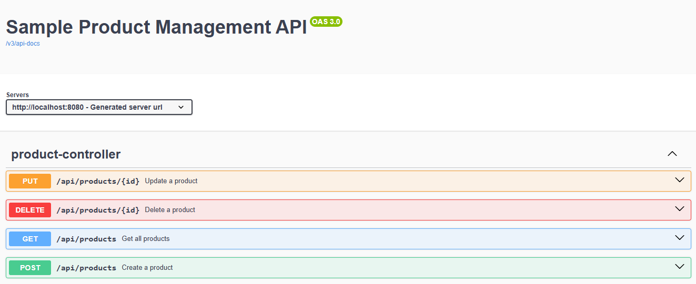

# DIO - Trilha Spring Framework

<div style="display:inline-block">
        <picture>
                <source media="(prefers-color-scheme: light)" srcset="https://img.shields.io/badge/Java-black?style=for-the-badge&logo=OpenJDK&logoColor=white">
                
        </picture>
        <picture>
                <source media="(prefers-color-scheme: light)" srcset="https://img.shields.io/badge/Maven-black?style=for-the-badge&logo=ApacheMaven&logoColor=white">
                
        </picture>
        <picture>
                <source media="(prefers-color-scheme: light)" srcset="https://img.shields.io/badge/Spring_Boot-black?style=for-the-badge&logo=SpringBoot&logoColor=white">
                
        </picture>
	<picture>
                <source media="(prefers-color-scheme: light)" srcset="https://img.shields.io/badge/FlyWay-black?style=for-the-badge&logo=FlyWay&logoColor=white">
                
        </picture>
        <picture>
                <source media="(prefers-color-scheme: light)" srcset="https://img.shields.io/badge/Swagger-black?style=for-the-badge&logo=Swagger&logoColor=white">
                
        </picture>
</div>

## Autor dos Exercícios e Repositório Original

* [Gleyson Sampaio](https://github.com/glysns)
* [Spring Boot e Swagger](https://github.com/digitalinnovationone/dio-springboot/tree/main/springboot-web-swagger)

## Exercício

Este repositório contém um exercício que demonstra a utilização do Swagger para documentar uma aplicação Spring Boot e que cobre os seguintes temas:

* REST e RESTful
* Controllers
* Swagger
* Exception Handler

## Spring Web

`Spring Web` é o módulo do Spring Framework dedicado ao desenvolvimento de aplicações web. Este módulo suporta diversas abordagens para a construção de aplicações, sendo uma da mais utilizadas a abordagem `REST`.

As anotações do Spring Web mais utilizadas são as seguintes:

| Anotação            | Descrição                                                                                                  |
| --------------------- | ------------------------------------------------------------------------------------------------------------ |
| `@RestController`   | Define a classe que irá tratar as requisições HTTP                                                        |
| `@RequestMapping`   | Quando usada a nível de classe, cria uma URI base pela qual a controller será acessada                     |
| `@GetMapping`       | Mapeia requisições GET para determinados métodos                                                          |
| `@PostMapping`      | Mapeia requisições POST para determinados métodos                                                         |
| `@PutMapping`       | Mapeia requisições PUT para determinados métodos                                                          |
| `@DeleteMapping`    | Mapeia requisições DELETE para determinados métodos                                                       |
| `@RequestBody`      | Indica que o parâmetro de um método deve ser vinculado ao valor do corpo de uma requisição HTTP         |
| `@PathVariable`     | É utilizada para tratar mudanças dinâmicas na URI onde um valor específico da URI age como um parâmetro |
| `@ControllerAdvice` | Define a classe que irá tratar exceções                                                                   |
| `@ExceptionHandler` | Anota o método que deve ser invocado para tratar determinada exceção                                      |

## API

`API` (Application Programming Interface) é um conjunto de definições e protocolos utilizado no desenvolvimento e integração de aplicações. Ela funciona como um mediador entre um usuário e os recursos que ele deseja acessar que podem estar por exemplo, em um banco de dados.

## REST

`REST` (Representational State Transfer) é um conjunto de restrições de arquitetura. Quando um cliente faz uma solicitação usando uma API RESTful (API em conformidade com as restrições REST), essa API retorna uma representação do estado do recurso solicitado. Essa representação é entregue via `HTTP` frequentemente no formato `JSON`.

<p align="center">
        
</p>

Para uma API ser considerada do tipo RESTful, é obrigatório que ela esteja em conformidade com os seguintes critérios:

* Ter uma arquitetura cliente/servidor com solicitações gerenciadas por HTTP;
* Estabelecer uma comunicação `stateless` entre cliente e servidor. Ou seja, nenhuma informação sobre o estado do cliente deve ser armazenada entre solicitações;
* Armazenar dados em cache para otimizar as interações entre cliente e servidor;
* Ter uma interface uniforme entre os componentes para transferência de informações em um formato padronizado, como JSON;
* Ter um sistema em camadas que organiza os tipos de servidores envolvidos na recuperação das informações solicitadas em hierarquias.

## Modelo de Maturidade de Richardson

O `modelo de maturidade de Richardson` é uma ferramenta para avaliar a maturidade de serviços web em termos de aderência aos critérios REST. O modelo foi proposto por Leonard Richardson e é composto por quatro níveis:

<p align="center">
        
</p>

### Nível 0: The Swamp of POX (Plain Old XML)

No nível 0, o HTTP é utilizado apenas como protocolo de transferência, sem a utilização dos diferentes métodos e do cache HTTP. Normalmente, as requisições para recuperar e salvar informações são feitas a uma mesma URI (Uniform Resource Identifier, é uma cadeia de caracteres utilizada para identificar recursos) e somente o método (ou verbo) POST é utilizado.

| Método | URI       | Operação         |
| ------- | --------- | ------------------ |
| POST    | /products | Pesquisar produto  |
| POST    | /products | Adicionar produto |
| POST    | /products | Editar produto    |
| POST    | /products | Excluir produto   |

### Nível 1: Resources

No nível 1, há uma distinção entre os recursos oferecidos por meio da utilização de URIs múltiplas, porém ainda há a utilização de apenas um verbo HTTP.

| Método | URI            | Operação         |
| ------- | -------------- | ------------------ |
| POST    | /products      | Pesquisar produtos |
| POST    | /products      | Adicionar produto  |
| POST    | /products/{id} | Editar produto     |
| POST    | /products/{id} | Excluir produto    |

### Nível 2: HTTP Verbs

No nível 2, há a adição dos verbos HTTP sendo utilizados corretamente para cada requisição.

| Método | URI            | Operação         |
| ------- | -------------- | ------------------ |
| GET     | /products      | Pesquisar usuário |
| POST    | /products      | Adicionar usuário |
| PUT     | /products/{id} | Editar usuário    |
| DELETE  | /products/{id} | Excluir usuário   |

Os verbos HTTP mais usados são:

* `GET`: retorna um recurso;
* `POST`: cria um recurso;
* `PUT`: edita um recurso;
* `DELETE`: exclui um recurso.

### Nível 3: Hypermedia Controls

O nível 3 é o nível mais alto e é uma junção do nível 2 com HATEOAS (Hypermedia as the Engine of Application State), que consiste em fornecer links que ajudam o usuário a navegar pelos recursos da API. Um exemplo de resposta à requisição `/products` utilizando o método `GET`, seria o seguinte:

```json
{
  "products": [
    {
      "id": "2b291e06-68cb-46ba-9c4f-b7a08e11f923",
      "name": "Caderno",
      "price": "27.9",
      "quantity": 2,
      "links": [
        {
          "type": "PUT",
          "uri": "/products/2b291e06-68cb-46ba-9c4f-b7a08e11f923"
        },
        {
          "type": "DELETE",
          "uri": "/products/2b291e06-68cb-46ba-9c4f-b7a08e11f923"
        }
      ]
    }
  ]
}
```

## Swagger

`Swagger` é um conjunto de ferramentas profissionais para desenvolvedores. O `Swagger UI`, mais especificamente, é uma das ferramentas e gera documentação e visualização interativa de APIs REST. Para utilizá-la, basta adicionar a dependência a seguir ao projeto Spring e rodar a aplicação.

```xml
<dependency>
    <groupId>org.springdoc</groupId>
    <artifactId>springdoc-openapi-starter-webmvc-ui</artifactId>
    <version>2.6.0</version>
</dependency>

```

O resultado pode ser visto no browser ao acessar a url http://localhost:8080/swagger-ui/index.html, e após algumas configurações adicionais com o uso de algumas anotações é o seguinte:

<p align="center">
        
</p>

## Referências

* Spring Framework Annotations - https://springframework.guru/spring-framework-annotations/
* O que é uma API REST? - https://www.redhat.com/pt-br/topics/api/what-is-a-rest-api
* Richardson Maturity Model - https://www.javatpoint.com/restful-web-services-richardson-maturity-model
* O que é HATEOAS? - https://www.treinaweb.com.br/blog/o-que-e-hateoas/
* Swagger UI - https://swagger.io/tools/swagger-ui/
* Swagger 2.X Annotations - https://github.com/swagger-api/swagger-core/wiki/Swagger-2.X---Annotations
